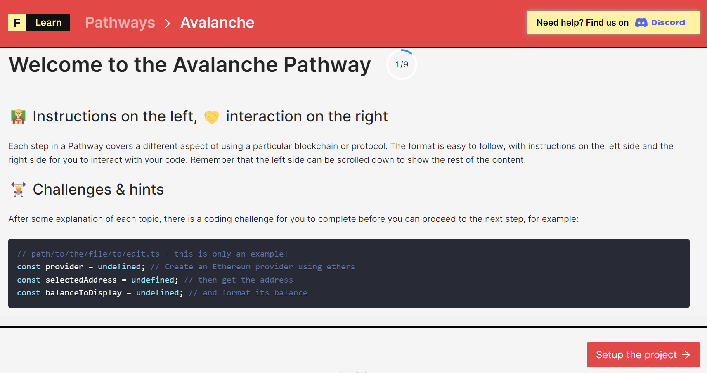
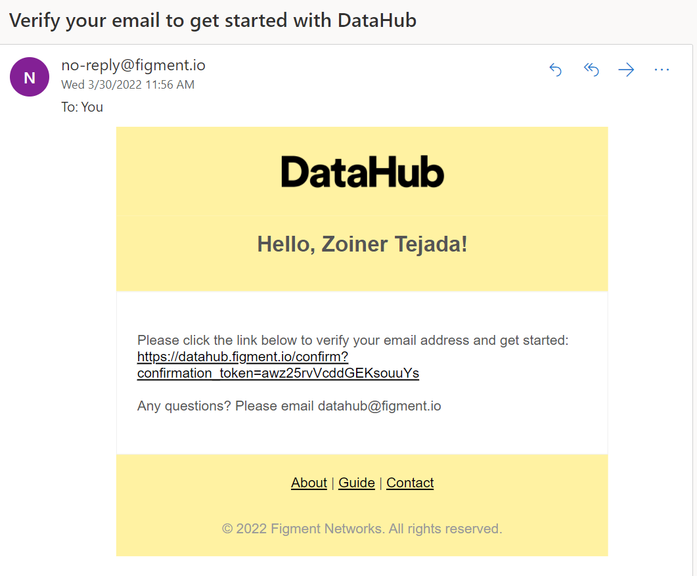
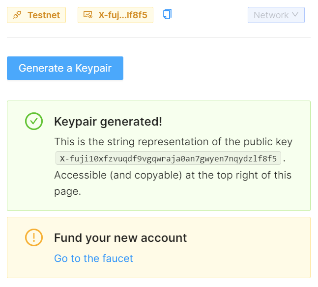
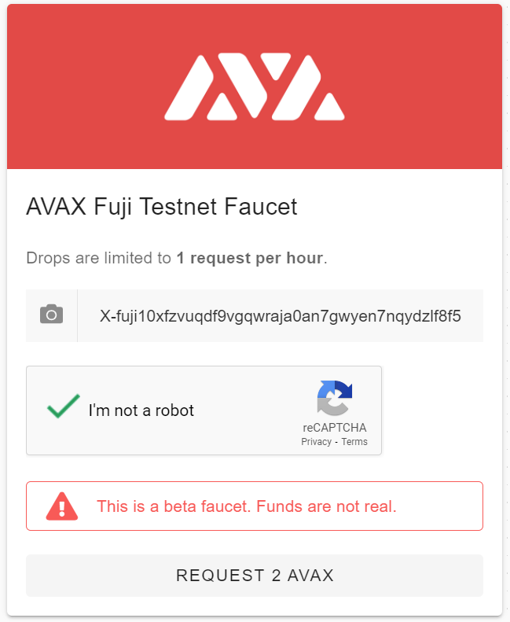
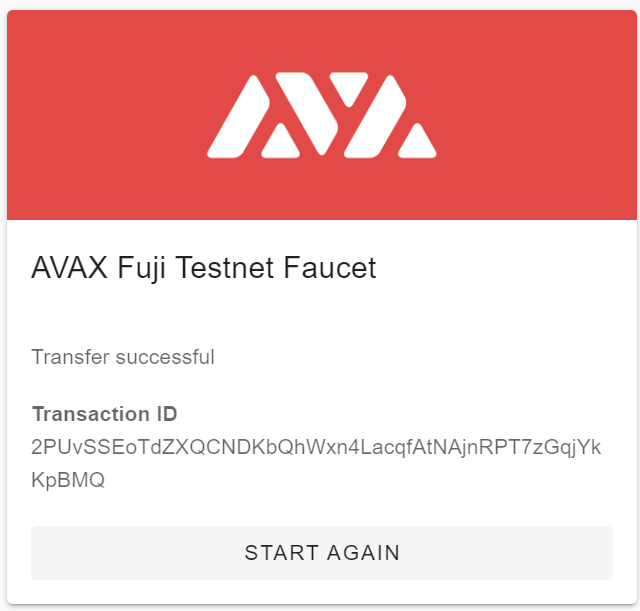
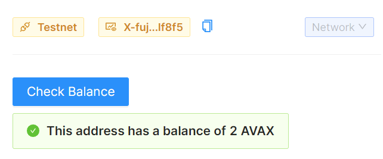
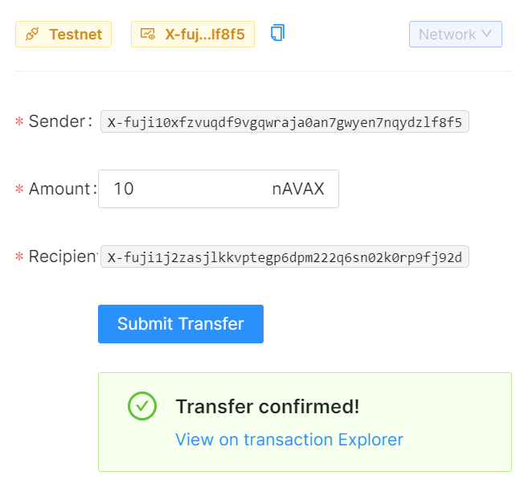
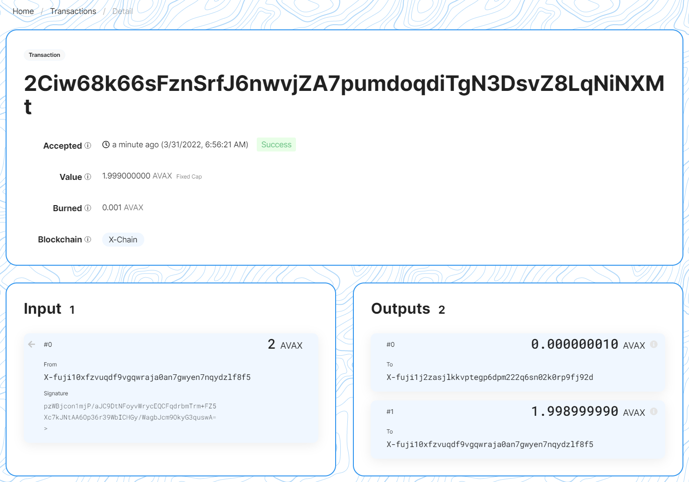
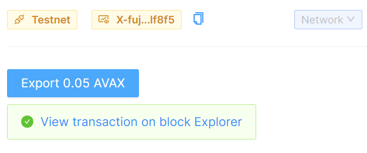
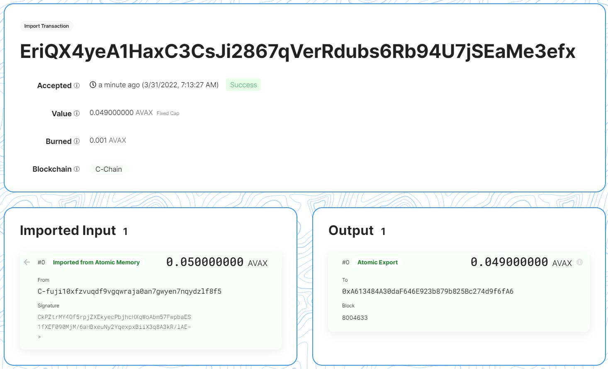

# Avalanche

Duration: ~2 hours

This lab will take you thru a client-side approach to working with the Avalance blockchain.

In this lab you will:

🔌 Connect to Avalanche with a Javascript library

🏦 Creat an account by generating a keypair and funding the resulting address by using the AVAX faucet

💸 Transfer tokens between accounts

♻️ Import and Export tokens between chains

1. With your Gitpod ready to use (you may need to select `Pathways`), within the **Simple Browser** tab, scroll down until you see the Chains listing.

2. Select **Avalanche**.

    

## Welcome to the Avalanche Pathway

1. Read the overview instructions that appear for the Pathway. This first step does not require you to make any code changes, it's just an overview of the approach so you know what to expect.

2. When you've finished reading the overview, look for a large navigation button labeled **Setup the project** near the bottom right of the **Simple Browser** panel and select that.

    

## Setup the project

1. Right click the **Signup for a DataHub account** [link](https://datahub.figment.io/signup) and select to open that in new tab in your browser.

    

2. Switch to that tab and complete the registration for the free DataHub account and select **Sign Up**.

    

3. Confirm your e-mail address.

    

    

4. Login to Datahub with the credentials you created

    

5. Return to the Gitpod environment and follow the instructions for acquiring a DataHub key and adding to your code. Remeber we are building an Avalanche app.

    - Create New App
    - Type an **App name**
    - For environment, type **Staging**
    - Select **Avalanche**
    - Select **Create app**
    - Select **View key**
    - Copy the key

6. When you have copied the key, you will to create a `.env` file in which to store it. Follow these steps:

   1. Switch back to the gitpod.

   2. From the left treeview of the Gitpod environment under the root folder `/learn-web3-dapp` locate the `.env.example` file.

   3. Right click the file and select **Rename**. Change the name to just `.env`

   4. Double click the `.env` file to open it in a new editor panel.

    

7. Paste your key as the value for the `DATAHUB_AVALANCHE_API_KEY` and close the `.env` tab.

    > NOTE: Whenever the instructions tell you edit code, look for the code file in the Explorer tree view just as you did for the `.env.example` file.

8. Select the navigation button **Connect to Avalanche** to continue.

## Connect to Avalanche

1. Follow the instructions to edit the `connect.ts` file.

2. In the **Network** dropdown, make sure to select the **Testnet** network before selecting connect otherwise you will see a 500 error (meaning unauthorized).

3. When complete you should see something like:

    

4. Select the navigation button **Create a keypair** complete to continue.

## Create a keypair

1. Follow the instructions to edit the `account.ts`. When complete you should see something like:

    

2. Copy the address of your wallet by clicking on the copy button. Then right click **Go to the faucet** to open the Avalanche faucet.

    

3. Paste in your address, complete the captcha and then select **REQUEST 2 AVAX**. You should see a confirmation like the following:

    

4. Return to the Gitpod window, select the navigation button **Get the balance** to continue.

## Get the balance

1. Follow the instructions to edit the `balance.ts` file. When complete you should see something like:

    

2. Select the navigation button **Transfer some AVAX** to continue.

## Transfer some AVAX

1. Follow the instructions to edit the `transfer.ts`. When complete you should see something like:

    

2. Open the **View on transaction explorer** link in a new browser tab and take moment to read the details of the transaction as it was captured in the blockchain.

    

3. Take a look at the value and compare it against the fee (labeled "Burned"). Also, observe how the UTXO transaction in this case yields
two outputs. Can you explain why?

4. Select the navigation button **Export tokens from X-Chain to C-Chain** to continue.

## Export tokens from X-Chain to C-Chain

1. Follow the instructions to edit the `export.ts` file. When complete you should see something like:

    

2. Select the navigation button **Import tokens from X-Chain to C-Chain** to continue.

## Import tokens from X-Chain to C-Chain

1. Follow the instructions to edit the `import.ts` file. When complete you should see something like:

    

2. Open the **View transaction on Avalanche Explorer** link in a new browser tab and take moment to read the details of the transaction as it was captured in the blockchain.

    

3. Select the navigation button **Pathway complete!** to continue.
