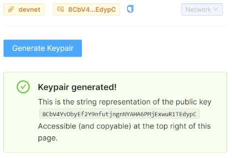

# Contents {#contents .TOC-Heading}

[Lab Setup [2](#lab-setup)](#lab-setup)

[Create a GitHub Account
[2](#create-a-github-account)](#create-a-github-account)

[Preparing your GitPod Environment
[6](#preparing-your-gitpod-environment)](#preparing-your-gitpod-environment)

[Polkadot Lab [8](#polkadot-lab)](#polkadot-lab)

[Welcome to the Polkadot Pathway
[9](#welcome-to-the-polkadot-pathway)](#welcome-to-the-polkadot-pathway)

[Setup the project [9](#setup-the-project)](#setup-the-project)

[Connect to Polkadot [13](#connect-to-polkadot)](#connect-to-polkadot)

[Create an Account [13](#create-an-account)](#create-an-account)

[Restore an account [18](#restore-an-account)](#restore-an-account)

[Estimate Transaction Fees
[19](#estimate-transaction-fees)](#estimate-transaction-fees)

[Get the Balance [19](#get-the-balance)](#get-the-balance)

[Existential Deposit [19](#existential-deposit)](#existential-deposit)

[Transfer Some Tokens
[20](#transfer-some-tokens)](#transfer-some-tokens)

[Avalanche [22](#avalanche)](#avalanche)

[Welcome to the Avalanche Pathway
[22](#welcome-to-the-avalanche-pathway)](#welcome-to-the-avalanche-pathway)

[Setup the project [23](#setup-the-project-1)](#setup-the-project-1)

[Connect to Avalanche
[27](#connect-to-avalanche)](#connect-to-avalanche)

[Create a keypair [27](#create-a-keypair)](#create-a-keypair)

[Get the balance [30](#get-the-balance-1)](#get-the-balance-1)

[Transfer some AVAX [31](#transfer-some-avax)](#transfer-some-avax)

[Export tokens from X-Chain to C-Chain
[32](#export-tokens-from-x-chain-to-c-chain)](#export-tokens-from-x-chain-to-c-chain)

[Import tokens from X-Chain to C-Chain
[33](#import-tokens-from-x-chain-to-c-chain)](#import-tokens-from-x-chain-to-c-chain)

[Solana [34](#solana)](#solana)

[Welcome to the Solana Pathway
[34](#welcome-to-the-solana-pathway)](#welcome-to-the-solana-pathway)

[Setup the project [35](#setup-the-project-2)](#setup-the-project-2)

[Connect to Solana [41](#connect-to-solana)](#connect-to-solana)

[Create an account [41](#create-an-account-1)](#create-an-account-1)

[Fund the account with SOL
[41](#fund-the-account-with-sol)](#fund-the-account-with-sol)

[Get the balance [42](#get-the-balance-2)](#get-the-balance-2)

[Transfer some SOL [43](#transfer-some-sol)](#transfer-some-sol)

[Deploy a program [44](#deploy-a-program)](#deploy-a-program)

[Create storage for the program
[45](#create-storage-for-the-program)](#create-storage-for-the-program)

[Get data [46](#get-data)](#get-data)

[Polygon [47](#polygon)](#polygon)

[Welcome to the Polygon Pathway
[47](#welcome-to-the-polygon-pathway)](#welcome-to-the-polygon-pathway)

[Setup the project [48](#setup-the-project-3)](#setup-the-project-3)

[Connect to Polygon [53](#connect-to-polygon)](#connect-to-polygon)

[Query Polygon [53](#query-polygon)](#query-polygon)

[Fund a Polygon account
[54](#fund-a-polygon-account)](#fund-a-polygon-account)

[Transfer some MATIC [55](#transfer-some-matic)](#transfer-some-matic)

[Deploy a Solidity Smart Contract
[56](#deploy-a-solidity-smart-contract)](#deploy-a-solidity-smart-contract)

[Set the storage of the contract
[58](#set-the-storage-of-the-contract)](#set-the-storage-of-the-contract)

[Get the storage of the contract
[59](#get-the-storage-of-the-contract)](#get-the-storage-of-the-contract)

[Restore your account
[59](#restore-your-account)](#restore-your-account)

# Lab Setup

Navigate to the labs URL:

<https://gitpod.io/#https://github.com/figment-networks/learn-web3-dapp>

{width="5.291938976377953in"
height="2.715417760279965in"}

Select Continue with GitHub.

Login with your GitHub credentials. If you don't have a GitHub Account,
follow the instructions in the section below to Create a GitHub Account.

# Create a GitHub Account

If you don't have a GitHub account yet, create one by selecting Create
Account.

{width="6.5in"
height="4.245138888888889in"}

{width="6.410051399825022in"
height="4.340500874890639in"}

{width="6.444775809273841in"
height="5.194711286089239in"}

{width="6.361438101487314in"
height="6.875353237095363in"}

{width="5.937805118110236in"
height="2.4792946194225722in"}

After confirming your email, return to the Lab URL.

## Preparing your GitPod Environment

Navigate to the Lab URL

When Gitpod first loads, it will appear something like this:

{width="6.5in"
height="4.010416666666667in"}

This layout can be a little restrictive on a small screen, so begin by
adjusting the layout to give the Sample Browser some more real-estate.
Drag the tab labeled Sample Browser to the left and drop it over the tab
labeled Get Started. Now you should be able to see the browser content
better (as shown in the figure). It's important because this is the view
that you will use to interact with your code changes.

{width="6.5in"
height="3.9451388888888888in"}

# Polkadot Lab

Duration: \~2 hours

This lab will take you thru a server-side approach to working with the
Polkadot blockchain.

In this lab you will:

🔌 Connect to Polkadot using a Javascript library

🏦 Create and fund an account with testnet tokens

🌱 Restore an account with a mnemonic seed phrase

🤔 Estimate transaction fees and view an account balance

😅 Understand the \"existential deposit\" which keeps accounts remaining
open

💸 Transfer tokens between accounts

With your Gitpod ready to use, within the Sample Browser tab, scroll
down until you see the Chains listing.

Select Polkadot.

{width="6.5in"
height="3.347916666666667in"}

## Welcome to the Polkadot Pathway

Read the overview instructions that appear for the Pathway. This first
step does not require you to make any code changes, it's just an
overview of the approach so you know what to expect.

When you've finished reading the overview, look for a large navigation
button labeled Setup the Project near the bottom right of the Sample
Browser panel and select that.

{width="6.5in"
height="3.0125in"}

## Setup the project

In this step, right click the Signup for DataHub link and select to open
that in new tab in your browser.

{width="5.798909667541557in"
height="3.1390507436570427in"}

Switch to that tab and complete the registration for the free DataHub
account.

{width="4.9655325896762905in"
height="6.63923009623797in"}

Confirm your e-mail address.

{width="5.8127985564304465in"
height="2.4584601924759406in"}

{width="6.5in"
height="5.372916666666667in"}

Login to Datahub with the credentials you created

{width="6.5in"
height="3.873611111111111in"}

Return to the Gitpod environment and follow the instructions for
acquiring a DataHub key and adding to your code.

Be sure to select Polkadot as the protocol when creating your app in
DataHub!

When you have copied the key, you will to create a .env file in which to
store it. Follow these steps:

1.  From the left treeview of the Gitpod environment under the root
    folder /learn-web3-dapp locate the file .env.example.

2.  Right click the file and select Rename. Change the name to just .env

3.  Double click the .env file to open it in a new editor panel.

{width="5.2502701224846895in"
height="0.888934820647419in"}

Paste your key as instructed and close the .env tab.

NOTE: Whenever the instructions tell you edit code, look for the code
file in the Explorer tree view just as you did for the .env.example
file.

Select the navigation button Connect to Polkadot to continue.

## Connect to Polkadot

Follow the instructions to edit your copy of connect.ts (remember you
can find this file using the Explorer in the Gitpod interface, under
/pages/api/Polkadot).

When you have completed the code, select the connect to Polkadot button.
If all went well you should see a shower of confetti and the Polkadot
version.

{width="5.437779965004374in"
height="3.6599103237095365in"}

Select the navigation button Create an Account to continue.

## Create an Account

Follow the instruction to complete account.ts to create a mnemonic, add
it to your key ring and then derive an account from that mnemonic to get
your wallet address.

When you have successfully completed the code, you should see something
like:

{width="4.6599617235345585in"
height="4.139102143482065in"}

Copy the address of your wallet by clicking on the copy button. Then
right click Go to the faucet to open the Polkadot faucet.

Sign up for the chat room.

{width="4.708575021872266in"
height="2.02788167104112in"}

You should select to login with your GitHub credentials.

{width="6.5in"
height="5.551388888888889in"}

Authorize matrix.org

{width="5.437779965004374in"
height="6.430885826771654in"}

Create your username for the chat.

{width="4.923863735783027in"
height="5.805854111986002in"}

Select Continue twice to complete the registration.

Return to the faucet page, which is:

[https://app.element.io/#/room/#westend_faucet:matrix.org](https://app.element.io/#/room/)

Select Join the Discussion

{width="4.757189413823272in"
height="1.8195384951881015in"}

Enter !drip followed by your wallet address to request the drip and wait
for the confirmation like so\
{width="6.236431539807524in"
height="1.5903597987751532in"}

Return to the instructions and select the navigation button labeled
Restore an account.

## Restore an account

Follow the instructions to learn how to restore your account from the
mnemonic. Once so successful you should see your restored address as
follows:

{width="5.361386701662292in"
height="3.368228346456693in"}

Select the navigation button Estimate transaction fees.

## Estimate Transaction Fees

Follow the instructions. When complete you should see something like:

{width="4.43078302712161in"
height="2.1320538057742784in"}

Select the navigation button Get the balance to continue.

## Get the Balance

Follow the instructions. When complete you should see something like:

{width="4.43078302712161in"
height="2.1459437882764654in"}

Select the navigation button Existential deposit to continue.

## Existential Deposit

Follow the instructions. When complete you should see something like:

{width="4.409948600174978in"
height="1.951489501312336in"}

Select the navigation button Transfer some tokens to continue.

## Transfer Some Tokens

Follow the instructions. When complete you should see something like:

{width="4.757189413823272in"
height="4.271053149606299in"}

Open the View on Block Explorer link in a new browser tab and take
moment to read the details of the transaction as it was captured in the
blockchain. Take a look at the value and compare it against the fee. For
reference 1 plank is 0.000000000001 WND.

{width="6.5in"
height="4.50625in"}

Select the navigation button Pathway complete to continue.

# Avalanche

Duration: \~2 hours

This lab will take you thru a client-side approach to working with the
Avalance blockchain.

In this lab you will:

🔌 Connect to Avalanche with a Javascript library

🏦 Creat an account by generating a keypair and funding the resulting
address by using the AVAX faucet

💸 Transfer tokens between accounts

♻️ Import and Export tokens between chains

With your Gitpod ready to use, within the Sample Browser tab, scroll
down until you see the Chains listing.

Select Avalanche.

{width="6.5in"
height="3.347916666666667in"}

## Welcome to the Avalanche Pathway

Read the overview instructions that appear for the Pathway. This first
step does not require you to make any code changes, it's just an
overview of the approach so you know what to expect.

When you've finished reading the overview, look for a large navigation
button labeled Setup the Project near the bottom right of the Sample
Browser panel and select that.

{width="6.5in"
height="3.426388888888889in"}

## Setup the project

In this step, right click the Signup for DataHub link and select to open
that in new tab in your browser.

{width="5.798909667541557in"
height="3.1390507436570427in"}

Switch to that tab and complete the registration for the free DataHub
account.

{width="4.9655325896762905in"
height="6.63923009623797in"}

Confirm your e-mail address.

{width="5.8127985564304465in"
height="2.4584601924759406in"}

{width="6.5in"
height="5.372916666666667in"}

Login to Datahub with the credentials you created

{width="6.5in"
height="3.873611111111111in"}

Return to the Gitpod environment and follow the instructions for
acquiring a DataHub key and adding to your code.

Be sure to select Avalanche as the protocol when creating your app in
DataHub!

When you have copied the key, you will need to create a .env.local file
in which to store it. Follow these steps:

1.  From the left treeview of the Gitpod environment under the root
    folder /learn-web3-dapp locate the file .env.example.

2.  Right click the file and select Rename. Change the name to just
    .env.local

3.  Double click the .env file to open it in a new editor panel.

{width="5.2502701224846895in"
height="0.888934820647419in"}

Paste your key as instructed and close the .env.local tab.

NOTE: Whenever the instructions tell you edit code, look for the code
file in the Explorer tree view just as you did for the .env.example
file.

Select the navigation button Connect to Avalanche to continue.

## 

## Connect to Avalanche

Follow the instructions. Make sure to select Network-\>Testnet before
selecting connect otherwise you will see a 500 error (meaning
unauthorized).

When complete you should see something like:

{width="4.500230752405949in"
height="3.3335050306211724in"}

Select the navigation button Create a keypair complete to continue.

## Create a keypair

Follow the instructions. When complete you should see something like:

{width="4.493286307961505in"
height="4.062708880139983in"}

Copy the address of your wallet by clicking on the copy button. Then
right click Go to the faucet to open the Avalanche faucet.

{width="4.507176290463692in"
height="5.493337707786527in"}

Paste in your address, complete the captcha and then select REQUEST 2
AVAX. You should see a confirmation like the following:

{width="4.444673009623797in"
height="4.243273184601925in"}

Return to Gitpod.

Select the navigation button Get the balance complete to continue.

## Get the balance

Follow the instructions. When complete you should see something like:

{width="4.458562992125985in"
height="1.854261811023622in"}

Select the navigation button Transfer some AVAX to continue.

## Transfer some AVAX

Follow the instructions. When complete you should see something like:

{width="4.528010717410324in"
height="4.180769903762029in"}

Open the View on transaction explorer link in a new browser tab and take
moment to read the details of the transaction as it was captured in the
blockchain.

{width="6.5in"
height="4.553472222222222in"}

Take a look at the value and compare it against the fee (labeled
"Burned"). Also, observe how the UTXO transaction in this case yields
two outputs. Can you explain why?

Select the navigation button Export tokens from X-Chain to C-Chain to
continue.

## Export tokens from X-Chain to C-Chain

Follow the instructions. When complete you should see something like:

{width="4.347445319335083in"
height="1.8125929571303587in"}

Select the navigation button Import tokens from X-Chain to C-Chain to
continue.

## Import tokens from X-Chain to C-Chain

Follow the instructions. When complete you should see something like:

{width="4.500230752405949in"
height="1.9098206474190726in"}

Open the View transaction on Avalanche Explorer link in a new browser
tab and take moment to read the details of the transaction as it was
captured in the blockchain.

{width="6.5in"
height="3.954861111111111in"}

Select the navigation button Pathway complete! to continue.

# Solana

Duration: \~2 hours

This lab will take you thru a client-side approach to working with the
Solana blockchain.

In this lab you will:

-   🔌 Connect to a Solana cluster using the web3.js library

-   🏦 Generate a new keypair, then fund the resulting address with an
    airdrop

-   💸 Transfer tokens between accounts

-   ⛓ Deploy and interact with a Solana program (aka Smart Contract),
    written in Rust

With your Gitpod ready to use, within the Sample Browser tab, scroll
down until you see the Chains listing.

Select Solana.

{width="6.5in"
height="3.347916666666667in"}

## Welcome to the Solana Pathway

Read the overview instructions that appear for the Pathway. This first
step does not require you to make any code changes, it's just an
overview of the approach so you know what to expect.

When you've finished reading the overview, look for a large navigation
button labeled Setup the Project near the bottom right of the Sample
Browser panel and select that.

{width="6.229484908136483in"
height="3.426388888888889in"}

## Setup the project

The first thing you need to do in this step is to install the Solana
CLI. To install the CLI into your GitPod instance, follow these steps:

1.  Near the bottom right of the Sample Browser panel, at the top of the
    terminal panel, select the + button and then select bash to create a
    new bash shell instance.\
    {width="2.8751476377952754in"
    height="2.3612325021872267in"}

2.  Within the bash shell that appears, paste the following command to
    download and install the Solana CLI.\
    \
    sh -c \"\$(curl -sSfL
    <https://release.solana.com/v1.10.5/install>)\"\
    \
    {width="6.5in"
    height="1.0451388888888888in"}

3.  When it finishes you will see a note to close and reopen your
    terminal to apply the path changes.

4.  Run the following command to add the Solana CLI path to your active
    terminal session:\
    \
    export
    PATH=\"/home/gitpod/.local/share/solana/install/active_release/bin:\$PATH\"

5.  Close the bash terminal you just opened by hovering over the word
    bash on the far right of the terminal area and selecting the trash
    icon.\
    {width="1.3959055118110235in"
    height="2.013992782152231in"}

6.  Load a new bash terminal instance by selecting the + button as you
    did before and selecting bash.\
    {width="3.2987806211723534in"
    height="2.3820669291338583in"}

7.  Confirm you have Solana installed by running:\
    \
    solana --version

8.  You should see output similar to the following:\
    \
    {width="4.833581583552056in"
    height="0.34029527559055117in"}

Next you will need to get you DataHub API keys. In this step, right
click the Signup for DataHub link and select to open that in new tab in
your browser.

{width="5.798909667541557in"
height="1.868597987751531in"}

Switch to that tab and complete the registration for the free DataHub
account.

{width="4.9655325896762905in"
height="6.63923009623797in"}

Confirm your e-mail address.

{width="5.8127985564304465in"
height="2.4584601924759406in"}

{width="6.5in"
height="5.372916666666667in"}

Login to Datahub with the credentials you created

{width="6.5in"
height="3.873611111111111in"}

Return to the Gitpod environment and follow the instructions for
acquiring a DataHub key and adding to your code.

Be sure to select Solana as the protocol when creating your app in
DataHub!

When you have copied the key, you will need to create a .env.local file
in which to store it. Follow these steps:

1.  From the left treeview of the Gitpod environment under the root
    folder /learn-web3-dapp locate the file .env.example.

2.  Right click the file and select Rename. Change the name to just
    .env.local

3.  Double click the .env file to open it in a new editor panel.

{width="5.2502701224846895in"
height="0.888934820647419in"}

Paste your key as instructed and close the .env.local tab.

NOTE: Whenever the instructions tell you edit code, look for the code
file in the Explorer tree view just as you did for the .env.example
file.

Select the navigation button Connect to Solana to continue.

## 

## Connect to Solana

Follow the instructions. Make sure to select Network-\>Devnet before
selecting connect otherwise you will see an error.

When complete you should see something like:

{width="4.500230752405949in"
height="1.4328401137357831in"}

Select the navigation button Create an account to continue.

## Create an account

Follow the instructions. When complete you should see something like:

{width="2.1038757655293088in"
height="1.4328401137357831in"}

Select the navigation button Fund the account with SOL to continue.

## Fund the account with SOL

Follow the instructions. When you select Fund this address you should
see something like:

{width="4.528010717410324in"
height="2.5487423447069117in"}

Open the View on Solana Explorer link in a new browser tab and take
moment to read the details of the transaction as it was captured in the
blockchain. Look at the fee that was charged. Also, examine the Transfer
Amount (SOL) to see how much was moved.

{width="6.5in"
height="4.236111111111111in"}

Select the navigation button Get the balance to continue.

## Get the balance

Follow the instructions. When you select Fund this address you should
see something like:

{width="3.5051345144356953in"
height="1.5996948818897638in"}

Select the navigation button Transfer some SOL to continue.

## Transfer some SOL

Follow the instructions to complete the code.

Provide the amount to transfer and select Generate an address to create
a random address to transfer the test funds to.

{width="4.479397419072616in"
height="3.0834919072615925in"}

Then select Submit Transfer. When you select Submit Transfer you should
see something like:

{width="4.5418996062992125in"
height="4.166881014873141in"}

Take a look at the transaction on the Solana Explorer.

Select the navigation button Deploy a program to continue.

## Deploy a program

Follow the instructions and execute the commands provided in your Gitpod
terminal.

When you get to the Challenge, be sure you go back to the Connect to
Solana step and change the Network to localnet. Then return to this
Deploy a program step to continue using the localnet as your network.

The output of your deployment includes the program ID you will need to
paste into the text box before selecting Check Deployment.

{width="5.47944772528434in"
height="1.0833891076115485in"}

Copy that value and paste it into the text box similar to the following:

{width="4.43078302712161in"
height="1.944543963254593in"}

Then proceed with completing the code. When you have done so and
selected Check Deployment, you should see something similar to the
following:

{width="5.28499343832021in"
height="3.014044181977253in"}

Select the navigation button Create storage for the program to continue.

## Create storage for the program

Follow the instructions, you should see something similar to the
following when successful:

{width="5.257214566929134in"
height="2.3959569116360453in"}

Select the navigation button Get data from the program to continue.

## Get data

Follow the instructions, you should see something like the following
when successful:

{width="2.700695538057743in"
height="2.104274934383202in"}

Select the navigation button Pathway Complete to continue.

# Polygon

Duration: \~2 hours

This lab will take you thru a client-side approach to working with the
Polygon blockchain.

In this lab you will:

-   🔌 Connect to Polygon with Metamask

-   ⁉️ Query Polygon for specific information

-   🏦 Fund a Polygon testnet account with the faucet

-   💸 Transfer tokens between accounts

-   ⛓ Deploy and interact with a Solidity smart contract

With your Gitpod ready to use, within the Sample Browser tab, scroll
down until you see the Chains listing.

Select Polygon.

{width="6.5in"
height="3.347916666666667in"}

## Welcome to the Polygon Pathway

Read the overview instructions that appear for the Pathway. This first
step does not require you to make any code changes, it's just an
overview of the approach so you know what to expect.

When you've finished reading the overview, look for a large navigation
button labeled Setup the Project near the bottom right of the Sample
Browser panel and select that.

{width="6.5in"
height="3.5215277777777776in"}

## Setup the project

The first thing you need to do is install the Metamask wallet on your
computer if you do not already have it. Select the link provided.

{width="4.80580271216098in"
height="1.1736712598425196in"}

On the Metamask site, select Download Now.

{width="3.39748031496063in"
height="2.2435389326334207in"}

This should take to a page that detects your browser and prompts you to
install the version appropriate to your browser. Select the "Install
Metamask for \<Your Browser Name\>"

{width="4.34446741032371in"
height="2.9148775153105864in"}

Follow the instructions after your download.

Next you will need to get you DataHub API keys. In this step, right
click the Signup for DataHub link and select to open that in new tab in
your browser.

{width="5.798909667541557in"
height="1.868597987751531in"}

Switch to that tab and complete the registration for the free DataHub
account.

{width="4.9655325896762905in"
height="6.63923009623797in"}

Confirm your e-mail address.

{width="5.8127985564304465in"
height="2.4584601924759406in"}

{width="6.5in"
height="5.372916666666667in"}

Login to Datahub with the credentials you created

{width="6.5in"
height="3.873611111111111in"}

Return to the Gitpod environment and follow the instructions for
acquiring a DataHub key and adding to your code.

Be sure to select Polygon as the protocol when creating your app in
DataHub!

When you have copied the key, you will need to create a .env.local file
in which to store it. Follow these steps:

1.  From the left treeview of the Gitpod environment under the root
    folder /learn-web3-dapp locate the file .env.example.

2.  Right click the file and select Rename. Change the name to just
    .env.local

3.  Double click the .env file to open it in a new editor panel.

{width="5.2502701224846895in"
height="0.888934820647419in"}

Paste your key as instructed and close the .env.local tab.

NOTE: Whenever the instructions tell you edit code, look for the code
file in the Explorer tree view just as you did for the .env.example
file.

Select the navigation button Connect to Polygon to continue.

## Connect to Polygon

Follow the instructions. When complete you should see something like:

{width="4.423838582677165in"
height="2.5487423447069117in"}

Select the navigation button Query Polygon to continue.

## Query Polygon

Follow the instructions. When complete you should see something like:

{width="5.069704724409449in"
height="4.437728565179353in"}

Select the navigation button Fund a Polygon account to continue.

## Fund a Polygon account

Follow the instructions. When complete you should see something like:

{width="4.514120734908136in"
height="2.6668033683289587in"}

Select the navigation button Transfer some MATIC to continue.

## Transfer some MATIC

Follow the instructions. You should be prompted with MetaMask to confirm
the transfer. Select Confirm after making sure the source address your
address.

{width="3.597407042869641in"
height="6.291990376202975in"}

When complete you should see something like:

{width="4.701630577427822in"
height="2.1876126421697286in"}

Select the navigation button Deploy a Solidity Smart Contract to
continue.

## Deploy a Solidity Smart Contract

Follow the instructions. When prompted to install truffle, you can use
bash from within GitPod. To do so follow these steps:

1.  In the terminal area (bottom quarter of the GitPod UI), select the
    bash item.\
    {width="1.3472911198600175in"
    height="0.9792169728783902in"}

2.  Next copy and paste the following command to install truffle using
    npm:\
    \
    npm install -g truffle

{width="5.361386701662292in"
height="0.5555839895013124in"}

3.  Next run the following:\
    \
    cd contracts/polygon/SimpleStorage

4.  Finally, run the following:\
    \
    yarn

When prompted to open a separate terminal window to run the truffle
development blockchain, follow these steps to split the current bash
window:

1.  Hover over bash near the right of the terminal window.

2.  Select the split window icon\
    {width="1.3542366579177603in"
    height="0.9583825459317585in"}

3.  In the new bash terminal, run the following command:\
    \
    truffle develop

When you get to the section titled Deploy the smart contract, you'll
want to make one change to the truffle configuration before following
the instructions to deploy the smart contract to the Mumbai test
network. You need to specify the gas price you are willing to pay for
the deployment. If you do not set this value, you will get a long error
that near the top indicates "transaction underpriced". Follow these
steps:

1.  Open contracts/polygon/SimpleStorage/truffle-config.js

2.  Scroll down into you see the configuration area for matic, and
    between the confirmation and timeoutBlocks keys, add a new key for
    gasPrice that is set for 35 gwei. Your addition should look similar
    to the following:

>     matic: {
>
>       provider: () =\>
>
>         new HDWalletProvider({
>
>           // As per the documentation at
> https://github.com/trufflesuite/truffle/tree/develop/packages/hdwallet-provider#general-usage
>
>           // \"If both mnemonic and private keys are provided, the
> mnemonic is used.\"
>
>           // Therefore, uncomment the following lines to use a
> mnemonic instead of a private key:
>
>           // mnemonic: {
>
>           //   phrase: mnemonic,
>
>           // },
>
>           privateKeys: \[privateKey\],
>
>           providerOrUrl: \`https://matic-mumbai.chainstacklabs.com\`,
>
>           chainId: 80001,
>
>         }),
>
>       network_id: 80001,
>
>       confirmations: 2,
>
> **      gasPrice: 35000000000,**
>
>       timeoutBlocks: 200,
>
>       skipDryRun: true,
>
>       chainId: 80001,
>
>     },

When you have migrated your smart contract, which causes the deployment
to the Mumbai test network, the output will provide the smart contract
address. Copy that value, paste it into the contact address textbox and
select Check deployment. Success should look similar to the following:

{width="5.028035870516185in"
height="3.9724267279090113in"}

Example address: 0x11ef085603162a59AB28CA66A59da6E9b8eC28Fb

Select the navigation button Set the storage of the contract to
continue.

## Set the storage of the contract

Follow the instructions. After completing the code changes, provide a
new value to store and select Set Value. You should see results similar
to the following:

{width="4.569679571303587in"
height="2.52790791776028in"}

Select the navigation button Get the storage of the contract to
continue.

## Get the storage of the contract

Follow the instructions. After completing the code changes, select Get
Value. You should see results similar to the following:

{width="4.569679571303587in"
height="2.173646106736658in"}

Select the navigation button Restore your account to continue.

## Restore your account

If you have reached this step in the lab, congratulations you have
completed the pathway! You can optionally choose to restore your wallet
from the mnemonic, but only do this if you are using a test wallet not
associated with any actual crypto assets.
